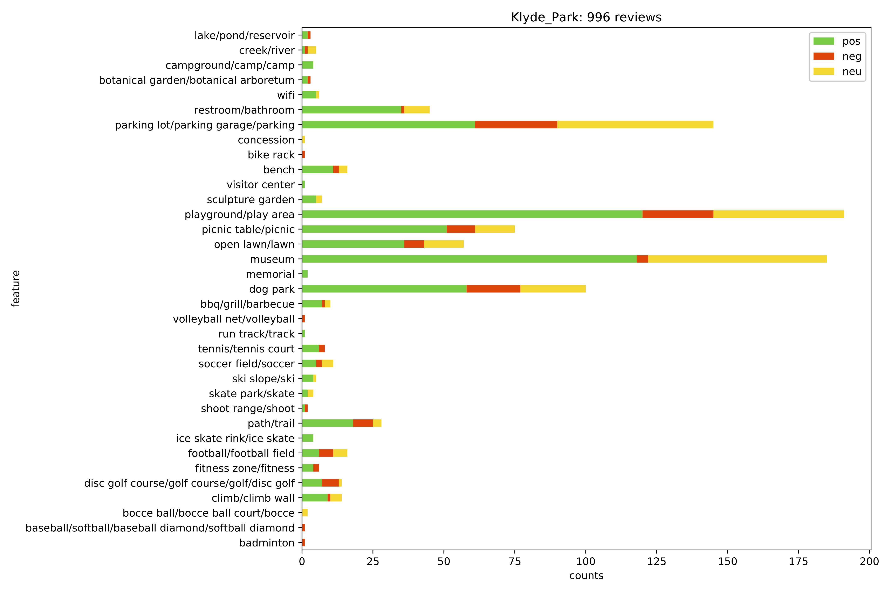

# ParkAmenity
Build a web-scraper to retrieve user reviews on parks and extract park amenity reviews.  

This project is written in Python. 
Project includes:
1) Develop a web-scraper to retrieve user review from social media platform(eg. tripAdvisor, Instagram..).
2) Sentiment analysis on people overall opinion on parks (positive & negative)
3) Extract park amenity features (trail, dog parks, court...) by keywords filtering/searching and compute sentiment score for each of extracted features. 

Sample Extracted features:
Griggs Parks, Dallas,TX
----------------------------------------------------------------------------------------------------
park
Positive: 18
          great potential park grade appropriately rebuilt .
          little rain puddle many place throughout park .
          lack many amenity park like klyde warren .
Neutral: 3
          dallas offer several actual dog park , mutt's , northpark dog park , even white rock lake .
          break ex dude park killer
          park two baseball / softball field basketball court .
Negative: 2
          nice park , bad dog owner don't pick dog poop !
          uptown spent lot money renovate park .
----------------------------------------------------------------------------------------------------
dog
Positive: 11
          city seem try crack dog owner let dog leash post signage don't seem much deterrent .
          park would much well off-leash dog absolutely everywhere poop everywhere else .
          it's kind smelly poop never time go don't encounter off-leash dog three .
Neutral: 2
          dallas offer several actual dog park , mutt's , northpark dog park , even white rock lake .
          usable space sport fin people $ 200 dog leash .
Negative: 2
          nice park , bad dog owner don't pick dog poop !
          dog run around without leash , careful dog feces .
----------------------------------------------------------------------------------------------------
playground
Positive: 2
          nice playground .
          03/25 / 17 - new playground , lot open space run around play , centrally locate .
Neutral: 0
Negative: 1
          there's small playground overall , griggs large green space .
----------------------------------------------------------------------------------------------------
area
Positive: 2
          wish shade area big water fountain middle would almost complete park .
          great space , open area type door activity .
Neutral: 1
          use open area opportunity play fetch .
Negative: 1
          play area little one though .
----------------------------------------------------------------------------------------------------

Sample results:

To be added.
